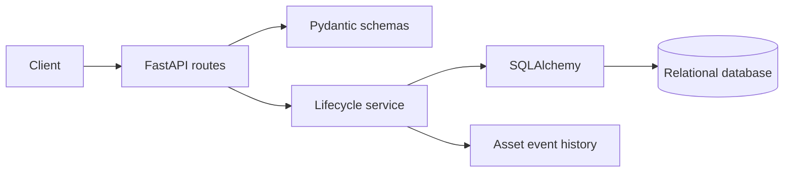

# AssetLedger architecture

## Boundaries

**API layer** handles HTTP concerns and maps domain failures to structured responses.

**Validation layer** owns the external request contract.

**Service layer** owns lifecycle rules such as assignment, repair, and retirement.

**Persistence layer** owns relational storage through SQLAlchemy.

**Audit history** records lifecycle events independently from the current asset row.

## Design goals

- keep lifecycle rules outside route handlers
- make the API testable through real request flows
- make current state and historical state independently inspectable
- avoid coupling the service layer to a specific HTTP framework
